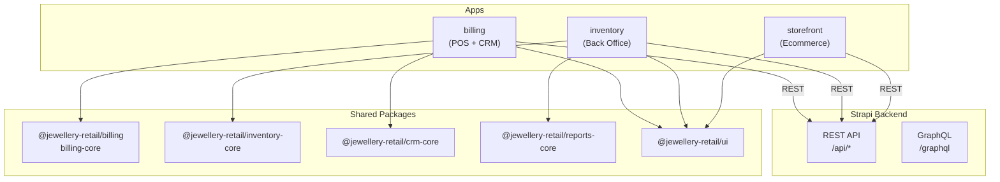
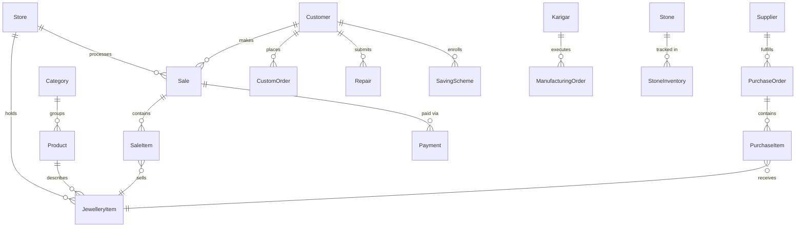
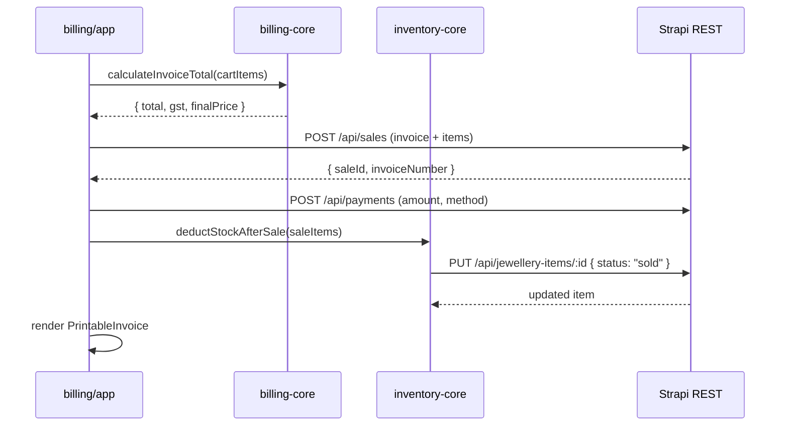

# Jewellery ERP — Full Architecture Plan

## What Exists Today


| Asset                              | Status | Notes                                           |
| ---------------------------------- | ------ | ----------------------------------------------- |
| `apps/backend`                     | Active | Strapi v5, TypeScript, 7 basic content types    |
| `apps/storefront`                  | Active | Next.js 14 + Tailwind + JSX, fully built        |
| `apps/billing`                     | Empty  | No package.json                                 |
| `apps/inventory`                   | Empty  | No package.json                                 |
| `packages/ui`                      | Active | Radix + shadcn components                       |
| `packages/billing`                 | Stub   | Empty `src/index.ts` — will become billing-core |
| `packages/auth/config/hooks/utils` | Stubs  | Will be expanded as needed                      |


---

## Final Monorepo Structure

```
mmj-retail-platform/
├── apps/
│   ├── backend/         Strapi v5 — full ERP API
│   ├── billing/         Next.js 15 — POS + CRM (new)
│   ├── inventory/       Next.js 15 — Back Office + Manufacturing (new)
│   └── storefront/      Next.js 14 — Ecommerce (existing, untouched)
├── packages/
│   ├── ui/              Shared Radix/shadcn components (existing)
│   ├── billing/         billing-core functions (expand existing stub)
│   ├── auth/            JWT/session helpers (expand existing stub)
│   ├── utils/           Shared utilities (expand existing stub)
│   ├── inventory-core/  New package
│   ├── crm-core/        New package
│   └── reports-core/    New package
└── tooling/tsconfig/
```

Package namespace: `@jewellery-retail/*` (matches existing convention).

---

## Architecture Overview




---

## Step 2 — Strapi Backend: Content Types

### Existing types (to extend, not replace)

- `category` — add `metal_type` field
- `product` — add `design_number`, `purity`, `metal_type` fields
- `customer` — add `mobile`, `address`, `city`, `pincode`, `pan_number`, `aadhaar_number`, `loyalty_points`, `credit_limit`, `notes`
- `supplier` — add `gst`, `city` fields
- `inventory` — **replace** with `jewellery-item` (richer schema)

### New content types to create

**Business**

- `store` — name, address, phone, gst_number, city, state, country
- `user-profile` — extends Strapi users-permissions User with role, store, active

**Inventory**

- `jewellery-item` — product(rel), barcode, tag_number, gross_weight, net_weight, stone_weight, purity, making_charges, status(enum: available/sold/repair/manufacturing), store(rel), location

**Stones**

- `stone` — name, type, carat, color, clarity, cost, supplier(rel)
- `stone-inventory` — stone(rel), quantity, cost

**Purchase**

- `purchase-order` — supplier(rel), date, total_amount, status(enum: draft/confirmed/received)
- `purchase-item` — purchase_order(rel), jewellery_item(rel), cost, weight

**Sales**

- `sale` — invoice_number, customer(rel), date, total_amount, gst_amount, payment_status(enum), store(rel)
- `sale-item` — sale(rel), jewellery_item(rel), gold_rate, making_charge, stone_cost, gst, final_price

**Payments**

- `payment` — sale(rel), amount, method(enum: cash/card/upi/bank), reference, date

**Orders**

- `custom-order` — customer(rel), design_reference, advance_amount, status(enum: pending/in-progress/ready/delivered/cancelled), expected_delivery

**Repairs**

- `repair` — customer(rel), item_description, issue, estimated_cost, status(enum), received_date, delivery_date

**Manufacturing**

- `manufacturing-order` — design, karigar(rel), issued_gold_weight, stone_used, wastage, final_weight, status(enum: issued/in-progress/completed)
- `karigar` — name, mobile, labour_type, labour_rate

**Finance**

- `expense` — title, category, amount, date, payment_mode
- `ledger-entry` — entity_type, entity_id, debit, credit, description, date

**Schemes**

- `saving-scheme` — customer(rel), monthly_amount, installments_paid, maturity_date, status

### Database Relations (ERD)




**Strapi schema files live at:** `apps/backend/src/api/[content-type]/content-types/[content-type]/schema.json`

Each new content type requires 4 files: `schema.json`, `controller.ts`, `route.ts`, `service.ts`.

---

## Step 3 — Billing App (`apps/billing`)

**Stack:** Next.js 15, Tailwind, shadcn/ui, JSX — mirrors storefront conventions.

`**package.json` name:** `@jewellery-retail/billing-app`

**Key dependencies:**

- `@jewellery-retail/ui`, `@jewellery-retail/billing`, `@jewellery-retail/crm-core`
- `@tanstack/react-query` for server state
- `react-hook-form` + `zod` for forms
- `react-barcode-reader` for POS scanning
- `axios` for Strapi API calls
- `recharts` for dashboard charts

### Page Structure

```
apps/billing/app/
├── layout.jsx
├── page.jsx                         → redirects to /dashboard
├── (auth)/
│   └── login/page.jsx
└── (pos)/
    ├── layout.jsx                   ← Sidebar + TopBar shell
    ├── dashboard/page.jsx           → KPIs: today's sales, gold rate, cash
    ├── billing/
    │   ├── page.jsx                 → New Sale (POS terminal)
    │   └── [invoiceId]/page.jsx     → Invoice view / print
    ├── customers/
    │   ├── page.jsx                 → Customer list + search
    │   ├── new/page.jsx             → Create customer
    │   └── [id]/
    │       ├── page.jsx             → Profile + credit ledger
    │       └── history/page.jsx     → Purchase history
    ├── orders/
    │   ├── page.jsx                 → Orders list
    │   └── new/page.jsx             → Create custom order
    ├── repairs/
    │   ├── page.jsx                 → Repairs list
    │   └── new/page.jsx             → Receive for repair
    ├── schemes/
    │   ├── page.jsx                 → Active schemes list
    │   └── new/page.jsx             → Enrol customer
    └── reports/
        ├── page.jsx                 → Daily sales summary
        ├── category/page.jsx        → Sales by category
        └── salesperson/page.jsx     → Staff performance
```

### POS Billing Page — Component Layout

```
BillingPage
├── GoldRateBar            ← live rate display
├── BarcodeScanner         ← scan / type tag number
├── ItemSearchPanel        ← search JewelleryItems
├── CartTable              ← selected items + quantities
│   ├── OldGoldRow         ← exchange deduction row
│   └── TotalsRow          ← gold_value + making + stone + GST = final
├── PaymentModeSelector    ← cash / card / UPI / bank
└── CheckoutButton         → POST /api/sales + POST /api/payments
```

---

## Step 4 — Inventory App (`apps/inventory`)

**Stack:** Next.js 15, Tailwind, shadcn/ui, JSX.

`**package.json` name:** `@jewellery-retail/inventory-app`

### Page Structure

```
apps/inventory/app/
├── layout.jsx
├── page.jsx                         → redirects to /dashboard
├── (auth)/
│   └── login/page.jsx
└── (back-office)/
    ├── layout.jsx                   ← Sidebar + TopBar shell
    ├── dashboard/page.jsx           → stock value, low stock, mfg orders
    ├── catalog/
    │   ├── products/
    │   │   ├── page.jsx             → Product list
    │   │   └── [id]/page.jsx        → Product detail
    │   ├── categories/page.jsx
    │   └── designs/page.jsx         → Design library
    ├── stock/
    │   ├── page.jsx                 → Current stock grid
    │   ├── inward/page.jsx          → Receive stock
    │   ├── transfer/page.jsx        → Store-to-store transfer
    │   ├── adjustment/page.jsx      → Manual adjustment
    │   └── audit/page.jsx           → Stock audit
    ├── barcode/
    │   ├── page.jsx                 → Tag generation + print
    │   └── scan/page.jsx            → Scan tag lookup
    ├── manufacturing/
    │   ├── page.jsx                 → Manufacturing orders list
    │   ├── new/page.jsx             → Create manufacturing order
    │   ├── gold-issue/page.jsx      → Issue gold to karigar
    │   ├── stones/page.jsx          → Stone allocation
    │   └── finished/page.jsx        → Receive finished goods
    ├── karigar/
    │   ├── page.jsx                 → Karigar list
    │   ├── new/page.jsx
    │   └── [id]/
    │       ├── page.jsx             → Karigar profile
    │       └── ledger/page.jsx      → Labour ledger
    ├── purchase/
    │   ├── page.jsx                 → Purchase orders list
    │   ├── new/page.jsx             → Create PO
    │   └── suppliers/
    │       ├── page.jsx
    │       └── [id]/page.jsx
    ├── melting/
    │   ├── page.jsx                 → Old gold intake
    │   └── refine/page.jsx          → Refining log
    └── reports/
        ├── page.jsx                 → Stock report
        ├── category/page.jsx        → Category-wise stock
        ├── dead-stock/page.jsx
        └── fast-moving/page.jsx
```

---

## Step 5 — Shared Packages

### `packages/billing` (expand existing stub → billing-core)

```javascript
// src/index.js
export function calculateMakingCharge(weight, ratePerGram, type) {}
export function calculateGST(baseAmount, gstRate = 3) {}
export function calculateInvoiceTotal({ goldWeight, goldRate, makingCharge, stoneCost, gstRate }) {}
export function oldGoldExchangeCalculator({ weight, purity, currentGoldRate }) {}
```

### `packages/inventory-core` (new package)

```javascript
export async function createStockEntry(itemData, strapiClient) {}
export async function deductStockAfterSale(saleItems, strapiClient) {}
export async function transferStock(itemId, fromStore, toStore, strapiClient) {}
export async function manufacturingEntry(orderData, strapiClient) {}
```

### `packages/crm-core` (new package)

```javascript
export async function createCustomer(customerData, strapiClient) {}
export async function customerLedger(customerId, strapiClient) {}
export async function customerPurchaseHistory(customerId, strapiClient) {}
```

### `packages/reports-core` (new package)

```javascript
export async function salesAnalytics({ storeId, from, to }, strapiClient) {}
export async function stockAnalytics(storeId, strapiClient) {}
```

---

## Step 6 — API Flow: POS Billing Sale




### Example API calls (Axios, from billing app)

```javascript
// 1. Fetch available jewellery items by tag/barcode
GET /api/jewellery-items?filters[barcode][$eq]=MMJ-001&populate=product,store

// 2. Create sale
POST /api/sales
{ data: { customer: 1, store: 1, total_amount: 52500, gst_amount: 1500, payment_status: "paid" } }

// 3. Create sale item
POST /api/sale-items
{ data: { sale: 101, jewellery_item: 44, gold_rate: 6200, making_charge: 3000, gst: 1500, final_price: 52500 } }

// 4. Mark item as sold
PUT /api/jewellery-items/44
{ data: { status: "sold" } }

// 5. Record payment
POST /api/payments
{ data: { sale: 101, amount: 52500, method: "upi", reference: "TXN123", date: "2026-03-13" } }
```

---

## Step 7 — Configuration Files

### `apps/billing/next.config.mjs`

```javascript
const nextConfig = {
  transpilePackages: ["@jewellery-retail/ui", "@jewellery-retail/billing"],
};
```

### `apps/inventory/next.config.mjs`

```javascript
const nextConfig = {
  transpilePackages: ["@jewellery-retail/ui", "@jewellery-retail/inventory-core"],
};
```

### Turbo pipeline — no changes needed (existing `dev`/`build` tasks cover new apps automatically via `apps/*` workspace glob)

---

## Step 8 — Future Extension Points

- **Multi-store:** `store` relation already present on `JewelleryItem`, `Sale`, `User`; API filters by `store.id`
- **Ecommerce storefront:** `storefront` app already exists; connect to same Strapi products/inventory endpoints
- **Mobile owner dashboard:** Add Next.js PWA config or expose a `/api/owner-summary` custom Strapi endpoint
- **WhatsApp invoices:** Add `whatsapp_number` to Customer; trigger Twilio/WATI webhook on Sale create via Strapi lifecycle hook in `src/api/sale/content-types/sale/lifecycles.ts`
- **Gold rate auto-update:** Strapi cron job in `src/index.ts` calling IBJA API every morning

---

## Implementation Order (Recommended)

1. Extend Strapi content types (backend first, everything depends on this)
2. Create 3 new packages: `inventory-core`, `crm-core`, `reports-core`
3. Expand `packages/billing` stub with billing-core functions
4. Scaffold `apps/billing` with Next.js + POS pages
5. Scaffold `apps/inventory` with Next.js + back-office pages
6. Wire API calls between apps and Strapi
7. Create change documentation

